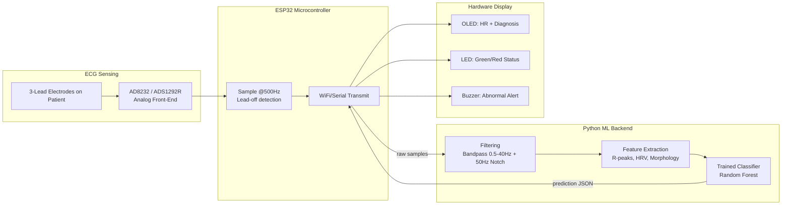
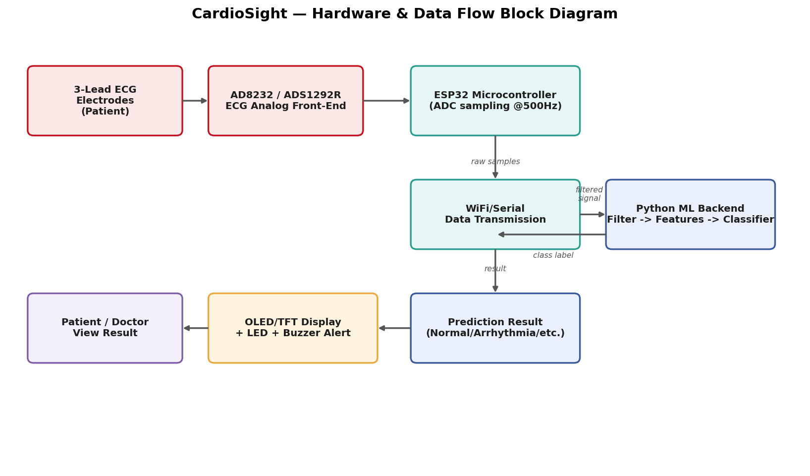
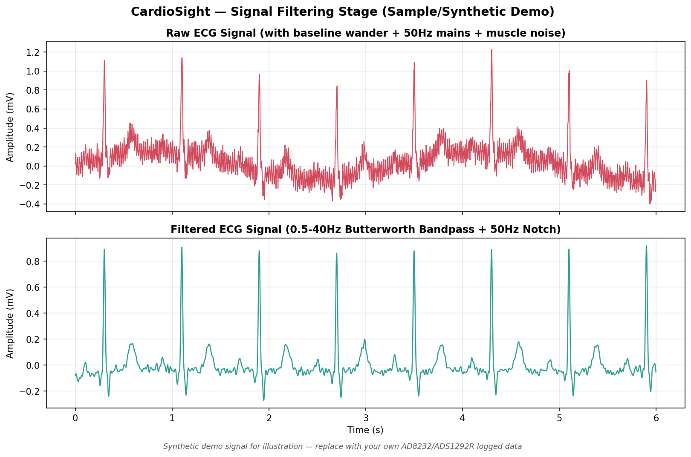
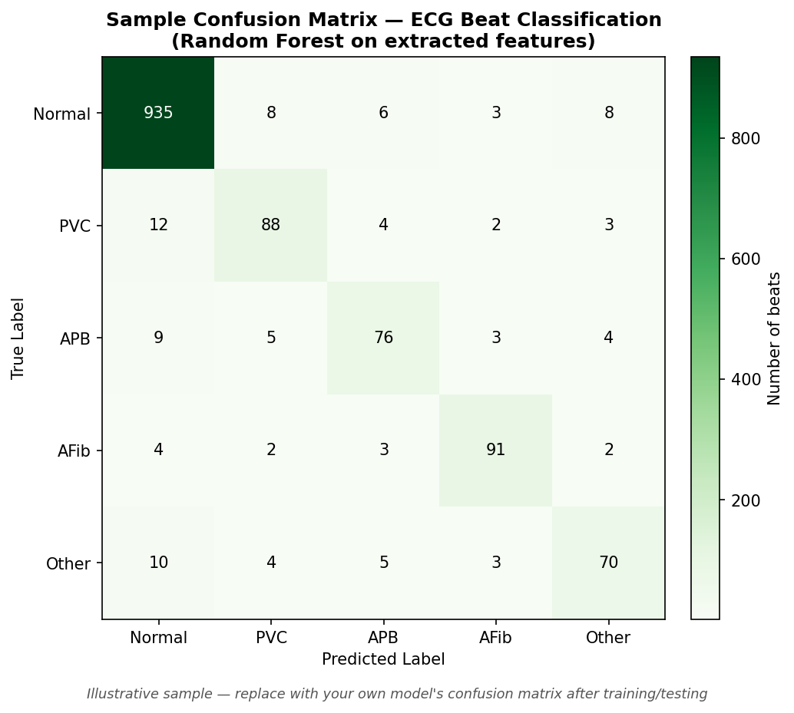

# ❤️ CardioSight — ECG-Based Disease Indication Detection using Machine Learning

[]()
[]()
[](LICENSE)
[]()

**CardioSight** is an end-to-end ECG monitoring system: a real ECG sensor captures raw heart signals, a microcontroller streams them to a filtering + machine learning pipeline that cleans the signal and flags indications of cardiac abnormalities, and the result is displayed back on dedicated hardware in real time.

> ⚕️ **Disclaimer:** CardioSight is an educational/college-project screening demonstrator, **not** a certified diagnostic medical device. Any abnormal indication it reports should be verified by a qualified medical professional using clinical-grade equipment.

---

## 📖 Table of Contents

1. [Overview](#-overview)
2. [Motivation](#-motivation)
3. [Objectives](#-objectives)
4. [System Architecture](#-system-architecture)
5. [Bill of Materials](#-bill-of-materials-bom)
6. [Circuit & Pin Connections](#-circuit--pin-connections)
7. [Signal Filtering Pipeline](#-signal-filtering-pipeline)
8. [Feature Extraction](#-feature-extraction)
9. [Machine Learning Model](#-machine-learning-model)
10. [Firmware](#-firmware)
11. [Setup & Installation](#-setup--installation)
12. [Testing Methodology](#-testing-methodology)
13. [Results](#-results)
14. [Repository Structure](#-repository-structure)
15. [Applications](#-applications)
16. [Future Scope](#-future-scope)
17. [Cost Estimate](#-cost-estimate)
18. [References](#-references)
19. [Images To Add](#-images-still-to-add-by-you)
20. [License](#-license)

---

## 🧭 Overview

CardioSight captures single-lead ECG using a medical-grade analog front-end (AD8232 / ADS1292R), streams raw samples from an ESP32 microcontroller to a Python-based machine learning backend, and runs the signal through three stages:

1. **Filtering** — a Butterworth bandpass + notch filtering algorithm removes baseline wander, 50Hz mains interference, and muscle noise to get the cleanest possible signal before analysis.
2. **Feature extraction & ML classification** — R-peak detection, heart-rate/HRV features, and a trained classifier flag disease indications (e.g. Normal, PVC, APB, AFib-type irregularities).
3. **Hardware display** — the prediction and live heart rate are sent back to the microcontroller and shown on an OLED display, with LED/buzzer alerts for abnormal readings.

This repository contains the firmware, the full ML pipeline (filtering → features → training → inference), generated reference diagrams/plots, and documentation to reproduce the project.

---

## 🎯 Motivation

- Cardiovascular disease is a leading cause of death globally, and early detection of arrhythmias significantly improves outcomes.
- Continuous, low-cost ECG screening devices can act as an early-warning layer, especially in areas with limited access to cardiologists.
- Combining classic DSP filtering with ML classification (rather than only threshold-based heart-rate alarms) allows the system to flag *patterns* — not just "too fast/too slow" — making it a much stronger demonstrator of applied signal processing + embedded ML.

---

## ✅ Objectives

1. Acquire clean, high-fidelity raw ECG signals using a proper analog front-end sensor.
2. Design and apply a filtering algorithm (bandpass + notch) to maximize signal quality before analysis.
3. Extract clinically meaningful features (heart rate, HRV, R-peak morphology) from the filtered signal.
4. Train and evaluate ML classifiers to detect indications of common cardiac abnormalities.
5. Build a hardware display + alert unit that shows live heart rate and diagnostic status.

---

## 🏗 System Architecture




*Figure 1: End-to-end hardware and data-flow block diagram (custom-generated, included at `assets/hardware_block_diagram.png`).*

---

## 🧰 Bill of Materials (BOM)

| # | Component | Purpose | Qty | Approx. Cost (INR) |
|---|-----------|---------|-----|----------------------|
| 1 | ESP32 Dev Board (WROOM-32) | Sampling + WiFi transmission | 1 | ₹450 |
| 2 | AD8232 Single-Lead ECG Sensor Module | Raw ECG analog front-end | 1 | ₹450 |
| 3 | *(Upgrade option)* ADS1292R ECG/Respiration AFE (24-bit, SPI) | Higher-quality digital ECG front-end | 1 | ₹2,500 |
| 4 | Disposable ECG Electrode Pads (3-lead) | Signal pickup from skin | 1 pack | ₹150 |
| 5 | 0.96" I2C OLED Display (SSD1306) | Live HR + diagnosis display | 1 | ₹250 |
| 6 | Status LEDs (Green + Red) | Visual normal/abnormal indicator | 2 | ₹10 |
| 7 | Active Buzzer | Audible abnormal alert | 1 | ₹15 |
| 8 | Jumper wires, perfboard/PCB, enclosure | Assembly | — | ₹500 |
| 9 | USB power bank / Li-ion cell + charging module | Portable power | 1 | ₹400 |

**Estimated total (AD8232-based build): ₹2,200 – ₹2,300**
**Estimated total (ADS1292R-based build): ₹4,200 – ₹4,300**

> The AD8232 is the standard choice for college-project ECG builds — cheap, well-documented, easy to interface. The ADS1292R gives noticeably cleaner, higher-resolution signal (useful if your ML classifier needs finer morphology detail) at a higher cost and SPI-level firmware complexity.

---

## 🔌 Circuit & Pin Connections

| Component | ESP32 Pin | Notes |
|---|---|---|
| AD8232 OUTPUT | GPIO 34 | Analog ECG signal (ADC1 channel) |
| AD8232 LO+ | GPIO 32 | Lead-off detect (goes HIGH if electrode disconnects) |
| AD8232 LO- | GPIO 33 | Lead-off detect |
| Green LED | GPIO 26 | Normal status indicator |
| Red LED | GPIO 27 | Abnormal status indicator |
| Buzzer | GPIO 25 | Abnormal alert |
| OLED SDA / SCL | GPIO 21 / GPIO 22 | I2C, address `0x3C` |

**Electrode placement (standard 3-lead):** RA (right arm) — LA (left arm) — RL (right leg, ground/reference). Clean the skin with alcohol wipes before placing electrodes for a lower-noise signal.

> ⚠️ **Safety note:** This is a body-worn sensing circuit. Power the AD8232/ESP32 stage from an isolated, battery-based supply (not directly off mains-connected USB adapters) while it is connected to a person, and have your project guide review the setup before live testing on any subject.

---

## 🧹 Signal Filtering Pipeline

Raw ECG straight off the AD8232 is contaminated with baseline wander (breathing/motion), 50Hz mains interference, and muscle (EMG) noise. `ml/filtering.py` implements the cleaning stage:

```python
def clean_ecg(raw_signal, fs=500.0, mains_freq=50.0):
    stage1 = bandpass_filter(raw_signal, fs=fs, low=0.5, high=40.0, order=4)  # Butterworth bandpass
    stage2 = notch_filter(stage1, fs=fs, freq=mains_freq, q=30)               # remove mains hum
    return normalize(stage2)
```




This filtered signal is what feeds both the R-peak/heart-rate calculation and the ML feature extraction — the whole point of this stage is maximizing the *signal quality* the downstream classifier sees, which directly drives classification accuracy.

---

## 🔬 Feature Extraction

`ml/feature_extraction.py` turns a filtered ECG window into a feature vector:

| Feature | Meaning |
|---|---|
| `heart_rate_bpm` | Average heart rate from R-R intervals |
| `num_beats` | Number of R-peaks detected in the window |
| `sdnn_ms` | HRV — standard deviation of NN intervals (overall variability) |
| `rmssd_ms` | HRV — root mean square of successive RR differences (short-term variability) |
| `mean_r_amplitude` / `std_r_amplitude` | R-peak morphology (amplitude consistency) |
| `signal_std` | Overall signal variability |

R-peaks are detected with `scipy.signal.find_peaks` on the filtered signal, with a minimum-RR-interval constraint to keep detections physiologically plausible (Pan-Tompkins-style simplified approach).

---

## 🤖 Machine Learning Model

- **Baseline model:** `RandomForestClassifier` (scikit-learn) trained on the hand-crafted feature vector above — a strong, explainable baseline that's easy to justify in a viva/report.
- **Classes detected:** `Normal`, `PVC` (Premature Ventricular Contraction), `APB` (Atrial Premature Beat), `AFib`-type irregularity, `Other`.
- **Training script:** [`ml/train_model.py`](ml/train_model.py) — splits data, trains, prints a classification report + confusion matrix, and saves the model bundle (`models/cardiosight_model.joblib`).
- A trained demo model is already included at `models/cardiosight_model.joblib`, trained on the **synthetic** dataset in `data/sample_features_labeled.csv` (see [`ml/generate_synthetic_dataset.py`](ml/generate_synthetic_dataset.py)) — this exists purely to prove the pipeline runs end-to-end. **Retrain on real data before reporting results** (see [`data/DATASET_README.md`](data/DATASET_README.md) for how to build a real labeled dataset from the MIT-BIH Arrhythmia Database).



---

## 💻 Firmware

Full firmware: [`firmware/CardioSight_ESP32_firmware.ino`](firmware/CardioSight_ESP32_firmware.ino)

- Samples the AD8232 output at 500Hz using a `micros()`-based timing loop.
- Monitors AD8232's `LO+`/`LO-` pins to detect electrode disconnection.
- Buffers 4 seconds of samples, POSTs them as JSON to the Python inference server, and parses back `{label, confidence, heart_rate_bpm}`.
- Drives the OLED display and green/red LED + buzzer based on the returned label.

**Libraries required** (Arduino IDE → Library Manager): `ArduinoJson`, `Adafruit_SSD1306`, `Adafruit_GFX`.

---

## 🛠 Setup & Installation

### 1. Hardware assembly
- Wire the AD8232 to the ESP32 per the pin table above.
- Attach 3-lead electrodes per the standard RA/LA/RL placement.
- Wire OLED, LEDs, and buzzer.

### 2. Python ML backend
```bash
cd ml
pip install -r requirements.txt

# quick pipeline test with synthetic data (optional, already included pre-trained)
python3 generate_synthetic_dataset.py
python3 train_model.py --data ../data/sample_features_labeled.csv

# start the inference server (WiFi mode, matches the firmware above)
python3 inference_server.py --mode wifi --http_port 5000
```

### 3. Firmware
- Install Arduino IDE + ESP32 board package + required libraries.
- Open `firmware/CardioSight_ESP32_firmware.ino`, update:
  - `WIFI_SSID`, `WIFI_PASSWORD`
  - `SERVER_URL` → `http://<your PC's LAN IP>:5000/predict`
- Flash to the ESP32. Make sure your PC and ESP32 are on the same WiFi network.

### 4. Build a real labeled dataset before reporting results
Follow [`data/DATASET_README.md`](data/DATASET_README.md) to derive real training features from the MIT-BIH Arrhythmia Database, then retrain with:
```bash
python3 train_model.py --data ../data/features_labeled.csv
```

---

## 🧪 Testing Methodology

1. **Filter validation:** Log a short raw ECG segment, run it through `ml/filtering.py`, and visually confirm baseline wander/mains hum are removed (compare to `assets/raw_vs_filtered_ecg.png`).
2. **Heart-rate accuracy:** Compare CardioSight's computed BPM against a reference pulse oximeter/known-good HR monitor on the same subject.
3. **Model validation:** Evaluate the trained classifier on a held-out test split of your real dataset; record accuracy, precision/recall per class, and the confusion matrix.
4. **End-to-end latency:** Measure time from buffer capture on the ESP32 to displayed result on the OLED.
5. **Lead-off handling:** Confirm the "Lead-off detected" message appears correctly when an electrode is disconnected.

---

## 📊 Results

Fill this in with your actual experimental numbers once real-data training and hardware testing are complete:

| Metric | Value |
|---|---|
| Filtering: noise reduction achieved | |
| Heart-rate accuracy vs reference monitor | |
| Classifier test accuracy (real dataset) | |
| Per-class precision/recall | *(see classification report)* |
| End-to-end latency (sensor → display) | |


---

## 📁 Repository Structure

```
CardioSight/
├── README.md
├── LICENSE
├── firmware/
│   └── CardioSight_ESP32_firmware.ino
├── ml/
│   ├── filtering.py
│   ├── feature_extraction.py
│   ├── generate_synthetic_dataset.py
│   ├── train_model.py
│   ├── inference_server.py
│   └── requirements.txt
├── models/
│   └── cardiosight_model.joblib      (demo model, retrain on real data)
├── data/
│   ├── DATASET_README.md
│   └── sample_features_labeled.csv   (synthetic — for pipeline testing only)
├── assets/
│   ├── hardware_block_diagram.png
│   ├── raw_vs_filtered_ecg.png
│   └── confusion_matrix_sample.png
├── scripts/
│   ├── generate_ecg_filter_demo.py
│   ├── generate_confusion_matrix.py
│   └── generate_hardware_diagram.py
└── docs/
    └── (add datasheets, wiring photos, report PDF here)
```

---

## 🚀 Applications

- Low-cost preliminary ECG screening in resource-limited clinics/camps
- Wearable/portable heart-health monitor for at-risk individuals
- Educational demonstrator for biomedical signal processing + embedded ML
- Base platform for a fitness-band-style continuous heart monitor

---

## 🔭 Future Scope

- Move from hand-crafted features to a **1D-CNN or LSTM** trained directly on raw filtered beat windows for richer morphology capture.
- Add **multi-lead ECG** (5/12-lead) for more clinically complete rhythm analysis.
- Detect **ST-segment elevation/depression** patterns as an early myocardial-infarction indication cue.
- Move inference **on-device** (e.g. TensorFlow Lite Micro on ESP32) to remove the WiFi round-trip dependency.
- Add **cloud storage + a doctor-facing dashboard** for remote monitoring of multiple patients.
- Validate against a larger, clinically annotated dataset beyond MIT-BIH for broader generalization.

---

## 💰 Cost Estimate

See [Bill of Materials](#-bill-of-materials-bom) — approximately **₹2,200–₹2,300** for the AD8232-based build, or **₹4,200–₹4,300** if upgrading to the ADS1292R front-end.

---

## 📚 References

1. Moody, G.B. & Mark, R.G. — *The MIT-BIH Arrhythmia Database* (PhysioNet).
2. Pan, J. & Tompkins, W.J. — *A Real-Time QRS Detection Algorithm*, IEEE Trans. Biomed. Eng., 1985.
3. AD8232 / ADS1292R manufacturer datasheets (Analog Devices / Texas Instruments).
4. scikit-learn documentation — Random Forest classifier.


---

## 📄 License

This project is released under the [MIT License](LICENSE) — free to use, modify, and build upon for academic or personal projects.

---

*Built as a college engineering project on biomedical signal processing and embedded ML for cardiac health screening. Contributions and suggestions welcome via issues/PRs.*
